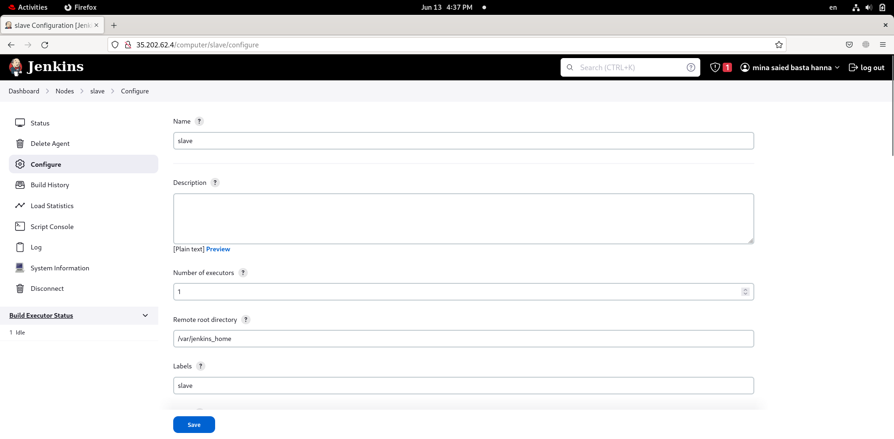
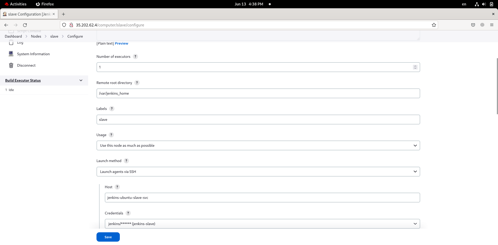
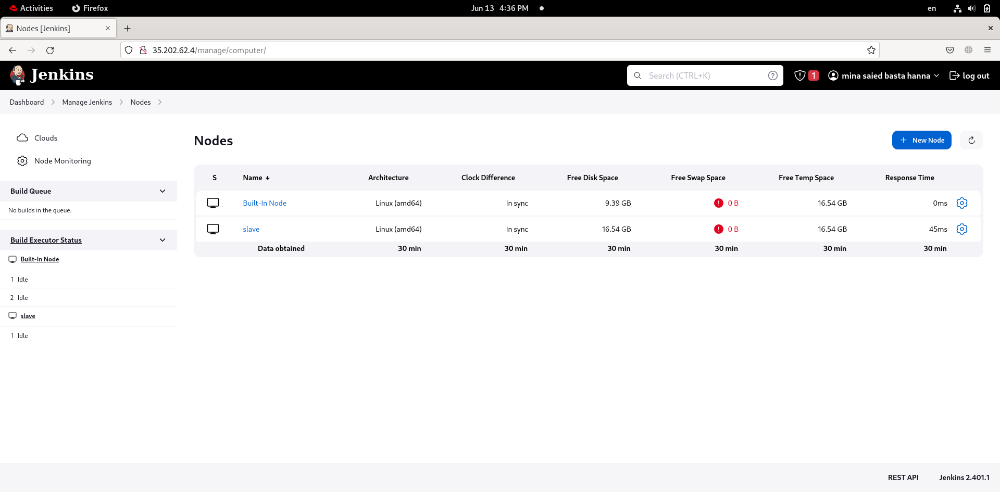
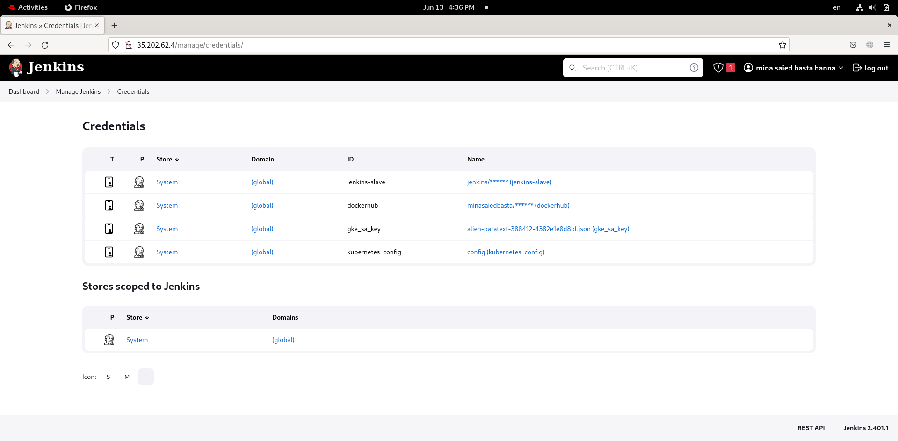
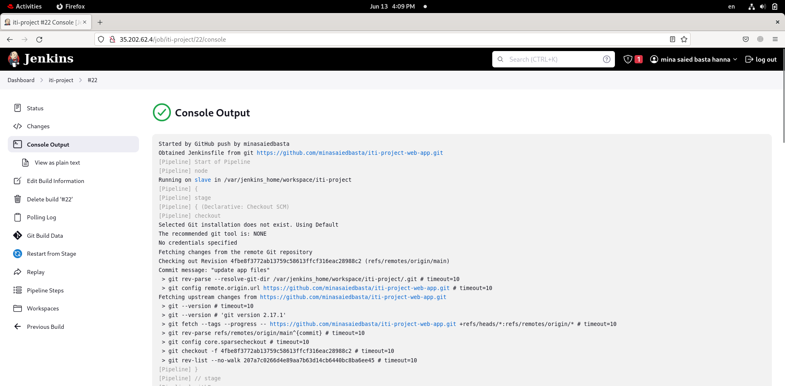
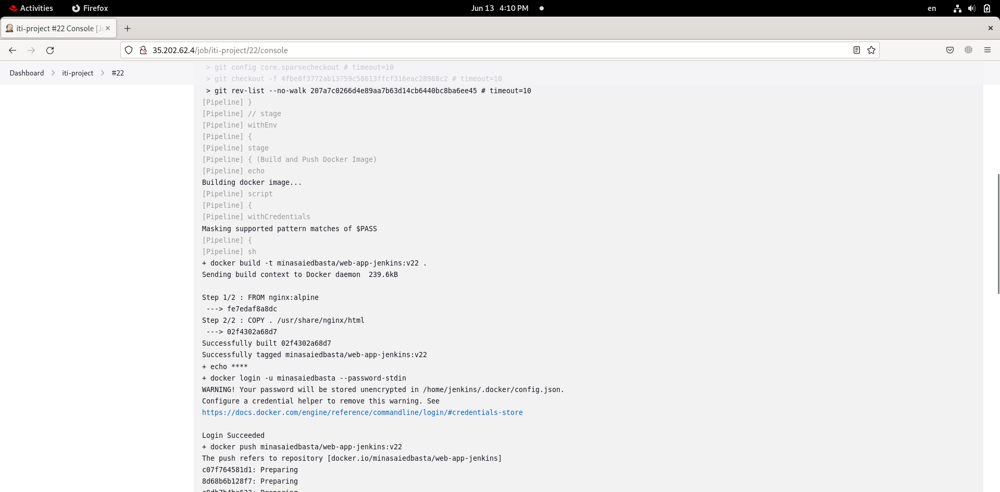
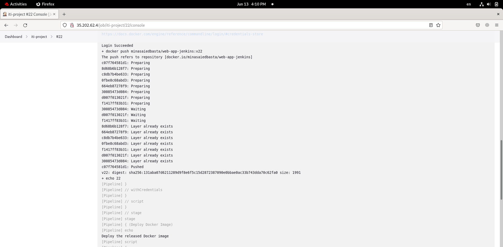
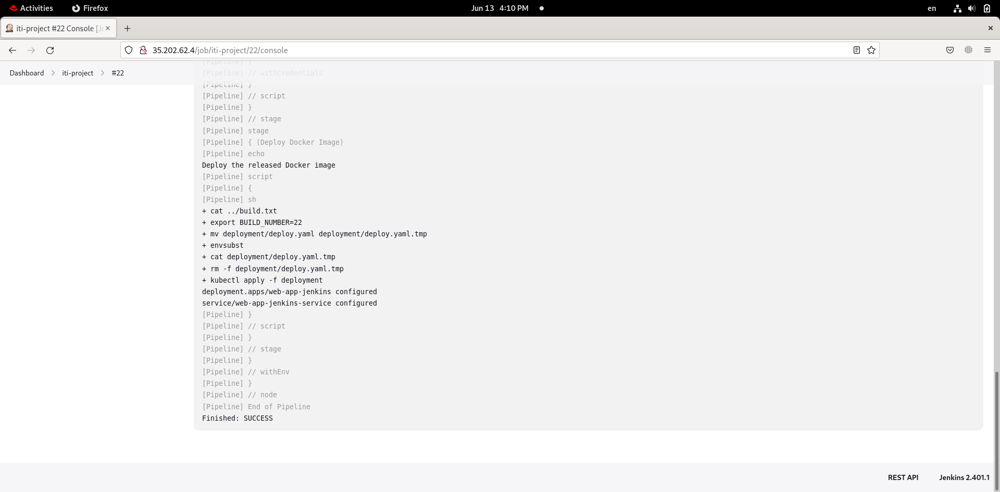
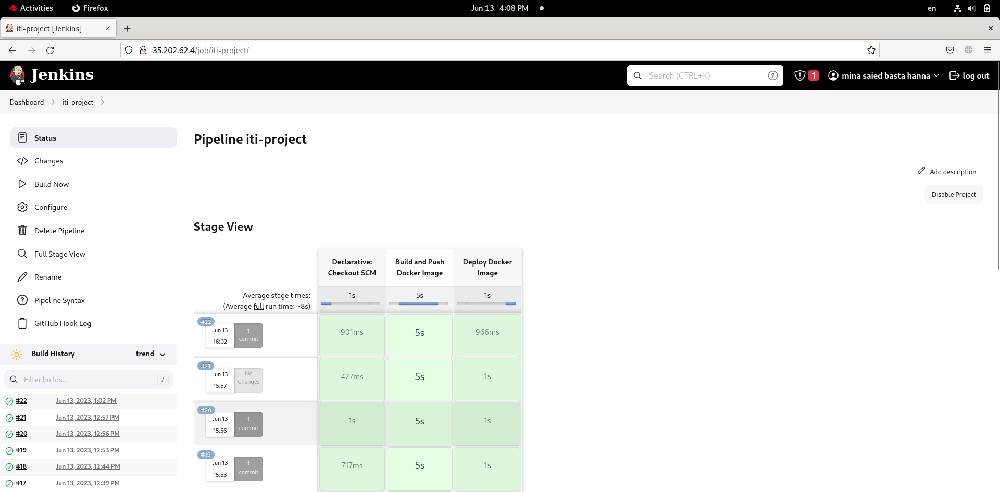

# ITI Devops Project

This is a devops project developed as part of a project at ITI (Information Technology Institute). The purpose of this project is to demonstrate infrastructure provisioning using Terraform as IaC (Infrastructure as Code) for deploying the web application on Kubernetes clusters on Google Cloud Platform (GCP).

## Table of Contents

- [Introduction](#introduction)
- [Features](#features)
- [Prerequisites](#prerequisites)
- [Installation](#installation)
- [Usage](#usage)
- [Terraform](#terraform)
- [Contributing](#contributing)
- [License](#license)

## Introduction

This project showcases the integration of Jenkins into a web application development workflow and demonstrates how Jenkins can be used to automate tasks such as building, testing, and deploying web applications. Additionally, it utilizes Terraform to provision the necessary infrastructure on GCP for running the web application on Kubernetes clusters.


## Features

- Continuous integration using Jenkins
- Deployment automation using Kubernetes on GCP
- Infrastructure provisioning with Terraform

## Prerequisites

To run this project, you need to have the following prerequisites:

1. [Google Cloud Platform (GCP) account with appropriate permissions](https://cloud.google.com/apigee/docs/hybrid/v1.7/precog-gcpaccount)
    - Create an account
    - Create a new project
    - Enable Required Apis
2. [gcloud CLI installed](https://cloud.google.com/sdk/docs/install#linux)
3. [Terraform CLI installed](https://developer.hashicorp.com/terraform/downloads?product_intent=terraform)
4. [The Kubernetes CLI (kubectl)](https://kubernetes.io/docs/tasks/tools/install-kubectl-linux/)

## Installation

### Clonning the repository:
```git
git clone https://github.com/minasaiedbasta/iti-web-app-jenkins.git
```

### Provisioning Infrastructure:
```bash
cd ./terraform
terraform init
terraform apply --auto-approve
```

### Provisioning Google Kubernetes Enginge Resources:
```bash
cd ../jenkins
kubectl apply -f .
```
### Configuration Of Jenkins Agent (aka:Slave):
1. On your local machine:
    - Generate a service account key from the console (and rename it to ```key.json```)
    - Generate kube ```config``` file and replace cluster external endpoint with the private one
2. On slave pod:
    - [install gcloud CLI tool (already included in the custom image)](https://cloud.google.com/sdk/docs/install#linux)
    - [install gke-gcloud-auth-plugin (already included in the custom image)](https://cloud.google.com/blog/products/containers-kubernetes/kubectl-auth-changes-in-gke)
    - use the generated service account key ```(key.json)``` to authenticate.
    - use the gererated kubeconfig file and move it to ```~/.kube/config```
    - validate the configuration by running (```kubectl cluster-info```)
### Setup Jenkins
1. Get jenkins load balabcer service endpoint (copy the **EXTERNAL-IP** value)
```bash
kubectl get service jenkins-loadbalancer -n jenkins
```
2. Hit the **EXTERNAL-IP** on your internet broweser
3. Get initial password from jenkins controller pod
```bash
kubectl exec -it <jenkins_controller_pod_name> -n jenkins -- bash -c "cat /var/jenkins_home/secrets/initialAdminPassword"
```
4. Setup an account and complete the installation steps
5. Add slave node 



6. Setup credentials 

7. Create a new pipeline job
    - add your git repo
    - add [Jenkinsfile](https://github.com/minasaiedbasta/iti-project-web-app/blob/main/Jenkinsfile) in root dirctory within your git repo
    - configure pipeline **Build Triggers** (optional)
    - start build your pipeline
    - watch logs
    
    
    
    
    

